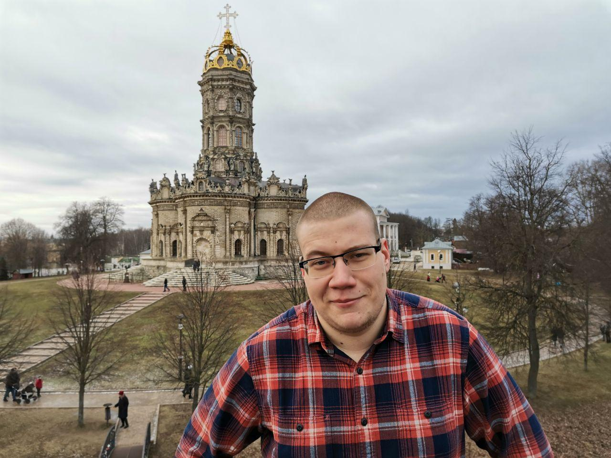

# About 

Mathematician by day, physicist by night. 

Since Fall 2020 PhD Student at UVA Math.

Since Fall 2019 I am working with [Leonid Petrov](https://lpetrov.cc/). 

I am a part of group led by [Maxim Timokhin](https://www.linkedin.com/in/myutimokhin/) focused on rarefied gas dynamics (in particular: LB method, UGKS).

CV (<a href='tikhonov_cv.pdf'>pdf</a>)
