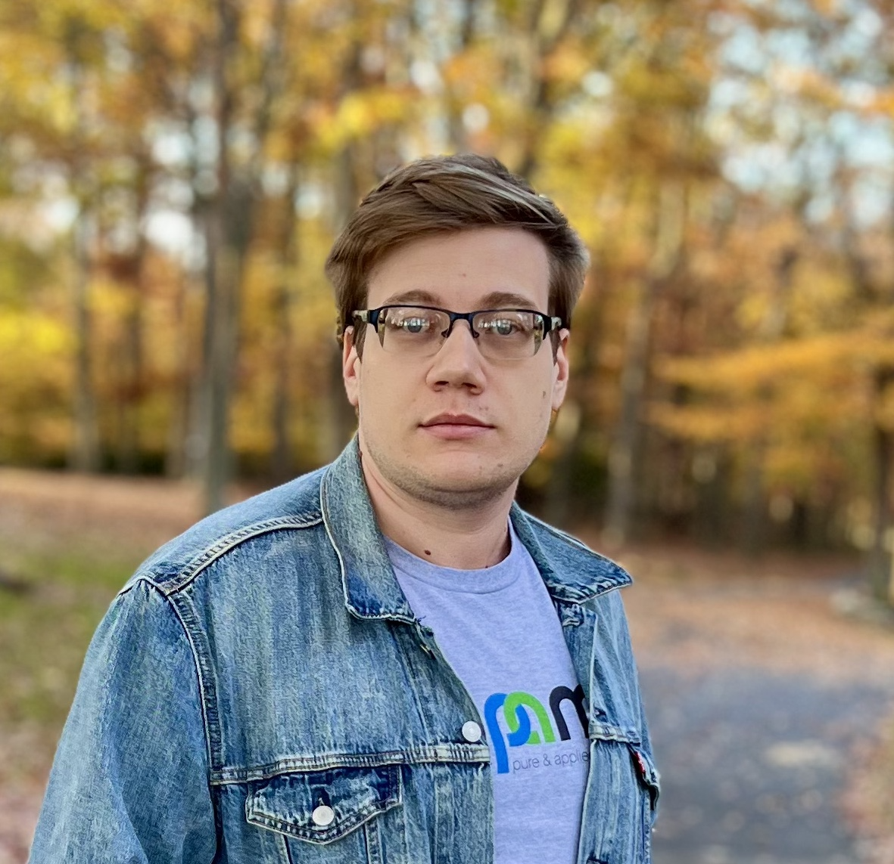

# About 

I am a PhD student/candidate at UVA Math, currently working under the supervision of [L. Petrov](https://lpetrov.cc/). 

My previous research experience include working with M. Timokhin on rarefied gas dynamics and applications, and with Prof. Koval on classical and quantum spin chain systems. 

For more details, take a look at my CV [here](MikhailTikhonovCV.pdf).
